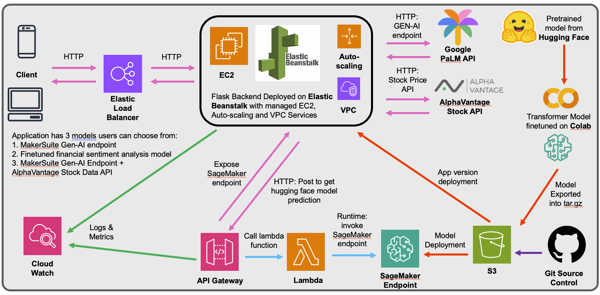

# finBERT The Stock Market Guru

### This application aims to allow users to get financial analysis based on:
- Stock Sentiment Analysis
- Stock Price Analysis

## Functionalities
1. finBERT: Get a stock sentiment based on a fine tuned [Distil RoBERTa model](https://huggingface.co/mrm8488/distilroberta-finetuned-financial-news-sentiment-analysis). With just 5 epochs of fine-tuning, we are able to achieve 85%-86% accuracy across metrics like recall, precision and F1-score on the [Financial Sentiment Analysis Kaggle Dataset](https://www.kaggle.com/datasets/sbhatti/financial-sentiment-analysis).
2. FinanceGPT: Get a stock sentiment from PaLM API using prompt engineering techniques.
3. StockPriceAnalyzer: Based on last 30 traded days stock prices from [AlphaVantage API](https://www.alphavantage.co/documentation/), we use prompt engineering to generate a stock price analysis from PaLM API.

## Architecture Diagram

1. Our Flask Application was deployed AWS Elastic Beanstalk.
2. Our fine tuned model is stored on an S3 bucket and deployed on AWS SageMaker.
3. Requests to the model is made through exposing an API Gateway endpoint which will invoke a lambda function to query our finetuned model deployed on AWS SageMaker.

## Disclaimer
This app provides stock price and sentiment analysis for informational purposes only. It should not be considered a substitute for professional financial advice.  All investment decisions carry risk, and you should conduct your own thorough research or consult with a qualified financial advisor before making any trades. 

## List of Contributors (BC3409 AI In Accounting and Finance Seminar 02)
| Name      |  Github Profile  |
| ------------- |:-----:|
| Khoo Teng Khing Joshua     | [suenalaba](https://github.com/suenalaba) |
| Au Yew Rong Roydon      | [roydonauyr](https://github.com/roydonauyr) |
| Michelle      | toupdate |
| Vinay   | toupdate |
| Hasif    | toupdate |